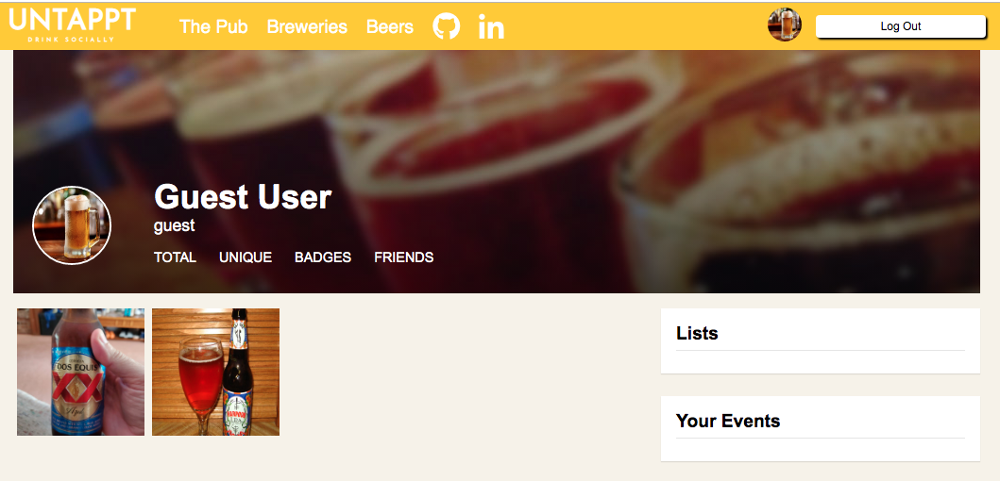
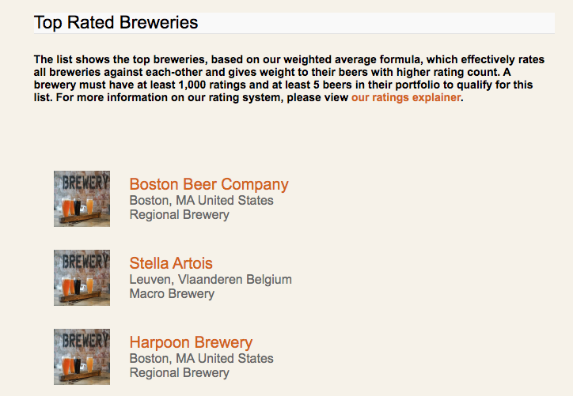
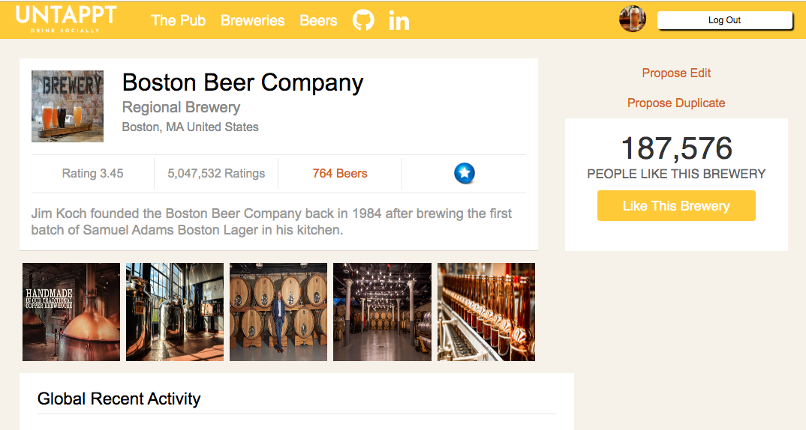
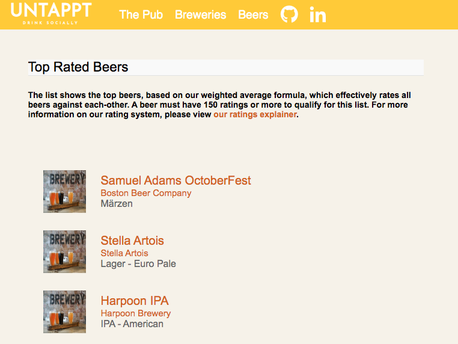
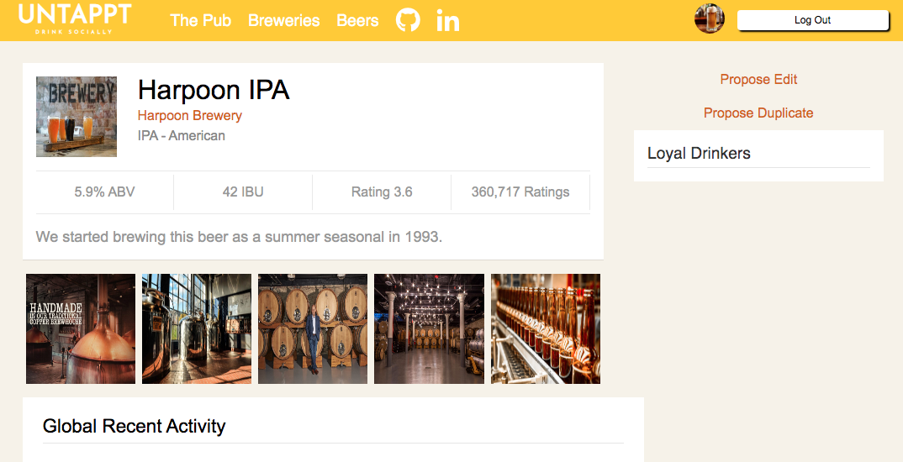

# Untappt

Untappt is a beer review website. It allows users to create, edit, review beer and breweries and share with friends. Users can also get beer and breweries information by searching in the website.

## Features

User authentification: User can sign up as a member and login.
User profile: Logged in users have profile pages with user information.
Brewery list: Logged in users have access to a full list of breweries that is saved in database.
Beer list: Logged in users have access to a full list of beer that is saved in database.
Brewery profile: Each brewery has its profile page with detailed information, including the beer it produced.
Beer profile: Each beer has its profile page with detailed information, including a link to the associated brewery.

## Technologies

### Backend
- Ruby 2.5.1
- Rails 5.2.3
- Postgresql

### Frontend
- React
- Redux
- JavaScript ES6

## Features Highlights

### User Profile Page

User profile page has information regarding the user, including first name, last name, username.

### Brewery Index Page

Users can browse the brewery list with all breweries in database.

### Brewery Profile Page

Each brewery has a profile page with detailed information.

### Beer Index Page

Users can browse the beer list with all beers in database.

### Beer Profile Page

Each beer has a profile page with detailed information.

## Upcoming Features
- In each beer show page, users will be able to checkin by clicking on the checkin button.
- User will be able to add other users as friends.
- User can search beer, breweries, and other users in a search bar.
